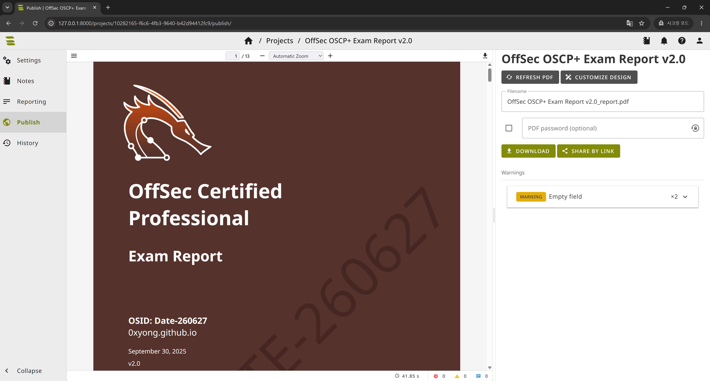
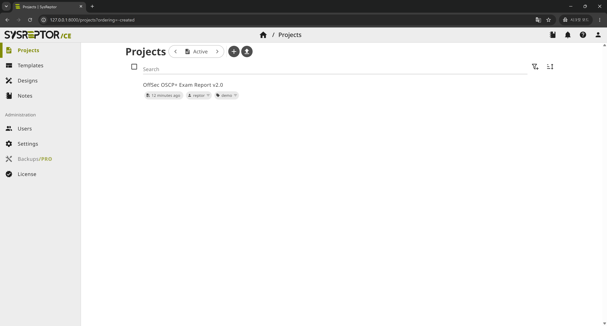
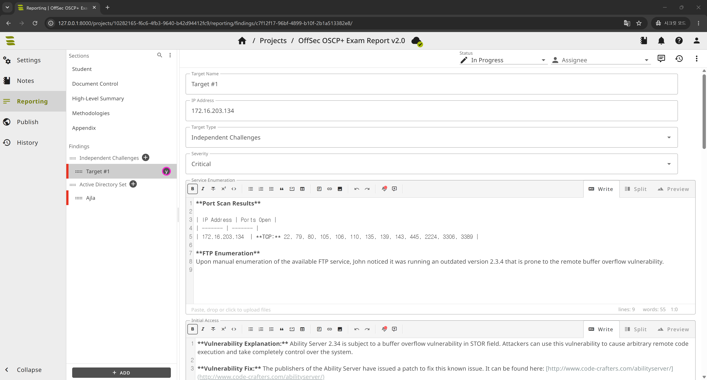

OSCP는 익스플로잇만 성공한다고 끝이 아닙니다. **정해진 형식의 리포트를 제출**해야 점수가 인정되죠. 시험이 끝나고 24시간 안에 깔끔한 PDF를 만들어 내야 하는데, 워드로 스크린샷 붙여넣다 보면 시간도 멘탈도 갈립니다.

[SysReptor](https://docs.sysreptor.com/)는 펜테스트 리포트 작성에 특화된 오픈소스 플랫폼입니다. **마크다운으로 쓰고 → HTML 디자인으로 → PDF 렌더링**하는 구조라, OffSec이 제공하는 공식 리포트 양식을 그대로 가져와 내용만 채우면 됩니다. 셀프 호스팅으로 직접 구축한 과정과 OSCP 리포트 작성 활용법을 정리합니다.



내용만 채우면 이렇게 OffSec 공식 양식에 맞춘 PDF 표지부터 본문까지 한 번에 떨어집니다. 위 화면이 이 글에서 만들 결과물입니다.

> [!info] 직접 구축이 부담된다면
> OffSec 시험용으로는 **무료 클라우드**도 제공됩니다 — [offsec.sysreptor.com/oscp/signup](https://offsec.sysreptor.com/oscp/signup/). 설치 없이 Pro 기능까지 쓸 수 있어, 시험 한 번만 칠 거면 이쪽이 더 빠릅니다. 아래는 데이터를 내 손에 두고 싶을 때의 셀프 호스팅 방법입니다.

## 1. 사전 준비

SysReptor는 Linux + Docker 기반입니다. 윈도우라면 **WSL2(Ubuntu)** 안에서 설치하면 됩니다.

- **OS**: Ubuntu (Kali, macOS 등에서도 동작)
- **RAM**: 최소 8GB
- **Docker** 필요

필요한 패키지와 Docker부터 설치합니다.

```bash
# 필수 도구
sudo apt update
sudo apt install -y sed curl openssl uuid-runtime coreutils

# Docker 설치
curl -fsSL https://get.docker.com | sudo bash

# 현재 사용자를 docker 그룹에 추가 (sudo 없이 docker 실행)
sudo groupadd docker 2>/dev/null
sudo usermod -aG docker $USER
newgrp -
```

> [!warning] WSL 사용 시
> WSL2에서는 Docker Desktop 연동을 켜거나, WSL 안에 직접 Docker 엔진을 설치해 `dockerd`가 떠 있어야 합니다. `docker ps`가 정상 동작하는지 먼저 확인하세요.

> [!note] `newgrp` 명령이 없다고 나올 때
> WSL 최소 이미지에는 `newgrp`가 빠져 있을 수 있습니다(`Command 'newgrp' not found`). 이 명령은 docker 그룹 권한을 **현재 셸에 바로 반영**하려는 편의용이라, 없으면 그냥 **터미널을 닫았다 다시 열면** 됩니다. 확실히 하려면 PowerShell에서 `wsl --shutdown` 후 다시 켠 뒤, `docker ps`가 sudo 없이 동작하는지 확인하고 다음 단계로 넘어가세요. (설치해서 쓰려면 `sudo apt install -y util-linux-extra` 후 `newgrp docker`)

## 2. SysReptor 설치

설치 스크립트 한 줄이면 소스 내려받기 · 설정 생성 · 볼륨/시크릿 구성 · 이미지 다운로드 · 컨테이너 기동까지 전부 처리됩니다.

```bash
bash <(curl -s https://docs.sysreptor.com/install.sh)
```

### 설치 중 나오는 질문들

스크립트가 진행되면서 몇 가지를 물어봅니다. 로컬에서 혼자 OSCP 리포트를 쓰는 기준으로 정리하면:

| 질문 | 의미 | 로컬 연습용 선택 |
|---|---|---|
| **License key** | 비우면 무료 Community Edition. 나중에 Pro 업그레이드 가능 | **그냥 Enter** (Community로 충분) |
| **Encrypt files and database?** | 업로드 파일·DB를 저장 시 암호화. 키 분실 시 복구 불가 | `n` (단순) 또는 `y`(보안, 단 `app.env` 백업 필수) |
| **Did you understand ... lose all data if app.env is gone?** | 암호화 선택 시 `app.env`에 키 저장 → 파일 잃으면 끝이라는 확인 | `y` (이해했으면) |
| **Setup a webserver (Caddy)?** | 다른 기기/인터넷에 노출할지. 기본은 `127.0.0.1`만 | `n` (이 PC에서만 쓰면 불필요) |

> [!warning] 암호화(y)를 골랐다면 — `app.env` 백업은 필수
> 암호화 키가 `deploy/app.env`에 저장됩니다. **이 파일 = 데이터**라서, 잃으면 리포트를 영영 못 엽니다. 설치 직후 안전한 곳에 복사해두세요.
> ```bash
> cp sysreptor/deploy/app.env ~/sysreptor-app.env.backup
> ```

> [!tip] WSL에서 접속
> Caddy(webserver)를 `n`으로 둬도 Windows 브라우저에서 `http://127.0.0.1:8000`로 바로 접속됩니다. WSL2가 localhost를 포워딩해주기 때문이에요.

설치가 끝나면 `sysreptor/` 디렉터리가 생기고, 브라우저에서 접속할 수 있습니다.

```
http://127.0.0.1:8000/
```

로그인하면 이런 프로젝트 목록 화면이 보입니다. 좌측에 Projects · Templates · Designs · Notes, 그리고 Administration(Users · Settings · License)이 정리돼 있습니다.



설치 과정에서 초기 관리자 계정을 만들게 됩니다. 추가로 슈퍼유저가 필요하면 언제든 만들 수 있습니다.

```bash
cd sysreptor/deploy
docker compose run --rm app python3 manage.py createsuperuser
```

> [!tip] 컨테이너 멈추고 켜기
> `cd sysreptor/deploy` 후 `docker compose stop` / `docker compose up -d`. 외부에서 접속하려면 Caddy·nginx 등으로 HTTPS 리버스 프록시를 앞에 두는 걸 권장합니다.

## 3. OffSec 공식 리포트 디자인 가져오기

여기가 핵심입니다. OffSec이 만든 시험 리포트 양식을 통째로 임포트할 수 있습니다. **OSCP+, OSEP, OSWP, OSWA, OSWE, OSED, OSMR, OSEE, OSDA, OSIR, OSTH** 디자인이 한 번에 들어옵니다.

```bash
cd sysreptor/deploy
url="https://docs.sysreptor.com/assets/offsec-designs.tar.gz"
curl -s "$url" | docker compose exec --no-TTY app python3 manage.py importdemodata --type=design
```

임포트가 끝나면 웹 UI의 **Designs** 메뉴에 OSCP Exam Report를 비롯한 양식들이 나타납니다. 직접 HTML/CSS를 짤 필요 없이, OffSec이 채점에서 기대하는 구조 그대로를 출발점으로 쓸 수 있습니다.

## 4. OSCP 리포트 작성 워크플로우

설치와 임포트가 끝났다면 실제 작성은 이렇게 흘러갑니다.

1. **새 프로젝트 생성** → 디자인으로 `OSCP Exam Report` 선택
2. **마크다운으로 본문 작성** — High-Level Summary, 각 머신별 침투 과정, 권한 상승, 사용한 명령어
3. **스크린샷 첨부** — 드래그&드롭으로 업로드, 본문에 바로 삽입. `proof.txt`·`local.txt` 캡처를 빠뜨리지 않기
4. **PDF 렌더링** — 버튼 하나로 OffSec 양식에 맞춘 PDF 생성



왼쪽에 OSCP 양식의 섹션(Student, High-Level Summary, Methodologies, Appendix)과 Findings가 그대로 잡혀 있고, 가운데 마크다운 에디터에서 타깃별 포트 스캔·열거·초기 침투를 적어 내려가면 됩니다. Write / Split / Preview 탭으로 작성하면서 결과를 바로 확인할 수 있습니다.

> [!important] 채점 통과의 핵심
> OSCP 리포트는 **재현 가능성**이 전부입니다. 채점관이 리포트만 보고 익스플로잇을 똑같이 재현할 수 있어야 합니다. 명령어는 복붙 가능한 형태로, 스크린샷에는 타깃 IP가 보이게, `proof.txt`는 `whoami`/`hostname`/`ip addr`와 함께 한 화면에 담으세요.

마크다운 작성이 익숙하다면 그 장점이 그대로 살아납니다. 코드 블록, 표, 콜아웃을 쓰면서도 최종 산출물은 OffSec 양식에 맞는 PDF로 떨어지니, "내용에만 집중"할 수 있다는 게 제일 큰 이점이었습니다.

## 5. 평소에 익혀두기

연습 머신을 풀 때부터 SysReptor에 정리하는 습관을 들이면, 실제 시험에서는 **풀이 과정을 그대로 옮겨 담기만** 하면 됩니다. 스크린샷 정리·명령어 기록을 풀이와 동시에 해두는 게 24시간 리포트 작성 시간을 가장 크게 줄여줍니다.

## 6. 서버 껐다 켜기

SysReptor는 Docker 컨테이너로 돌기 때문에 **PC를 끄거나 WSL/Docker가 멈추면 같이 내려갑니다.** 다음 날 다시 쓰려면 이렇게 켜면 됩니다.

```bash
# 1. Docker가 떠 있는지 확인 (에러 나면 sudo service docker start 또는 Docker Desktop 실행)
docker ps

# 2. 컨테이너 시작
cd sysreptor/deploy
docker compose up -d

# 3. 상태 확인 후 http://127.0.0.1:8000 접속
docker compose ps
```

끌 때는 같은 위치에서 `docker compose stop`.

| 동작 | 명령 |
|---|---|
| 켜기 | `cd sysreptor/deploy && docker compose up -d` |
| 끄기 | `cd sysreptor/deploy && docker compose stop` |
| 상태 확인 | `docker compose ps` |
| 로그 보기 | `docker compose logs -f app` |

> [!note] 자동 시작
> 컨테이너 재시작 정책이 보통 `unless-stopped`라, **Docker 데몬만 떠 있으면 재부팅 후 자동으로 다시 올라옵니다.** 다만 WSL은 부팅 시 자동으로 안 켜질 수 있으니, 터미널을 한 번 열어 `docker ps`로 확인하는 습관만 들이면 됩니다.

---

> [!summary] 한 줄 요약
> WSL/Linux + Docker에 **설치 스크립트 한 줄**로 SysReptor를 올리고, **OffSec 공식 디자인을 임포트**하면 OSCP 리포트를 마크다운으로 쓰고 PDF로 뽑는 환경 완성. 클라우드 무료판도 있으니 상황 맞게 고르세요.

## 참고

- [SysReptor 공식 문서](https://docs.sysreptor.com/)
- [OffSec Reporting with SysReptor](https://docs.sysreptor.com/offsec-reporting-with-sysreptor/)
- [Syslifters/OffSec-Reporting (GitHub)](https://github.com/Syslifters/OffSec-Reporting)
- [OSCP Exam Report 데모 PDF](https://docs.sysreptor.com/assets/reports/OSCP-Exam-Report.pdf)
