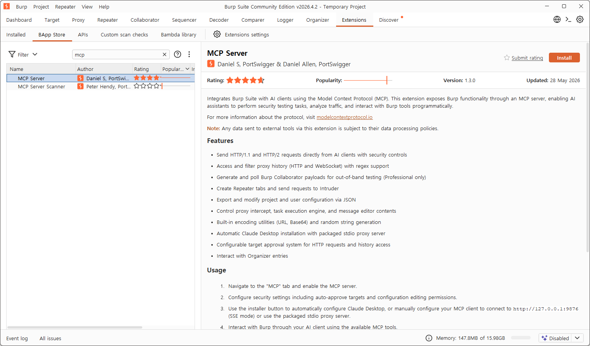

요즘 진단할 때 **MCP(Model Context Protocol)** 를 적극적으로 쓰고 있습니다. Ghidra로 디컴파일한 함수를 Claude한테 바로 던져서 "이 함수 뭐하는 거야?"라고 묻고, Burp 프록시 히스토리를 AI가 직접 훑어보게 하고, jadx로 까낸 APK 클래스를 Claude가 읽고 SAST를 돌리는 식이죠. **도구와 AI 사이에 사람이 복붙하던 과정이 사라지니** 분석 속도가 확 빨라집니다.

이 글에서는 **Ghidra · Burp Suite · jadx** 세 도구를 **Claude(Desktop / Claude Code)** 에 MCP로 연동하는 방법을 정리합니다.

> [!info] MCP가 뭔데?
> **Model Context Protocol**은 Anthropic이 공개한 표준으로, **AI 모델이 외부 도구·데이터에 접근하는 규약**입니다. USB-C처럼 "AI ↔ 도구"를 꽂는 표준 단자라고 보면 됩니다.
> 구조는 대부분 **① 도구 안에서 도는 서버(플러그인/익스텐션) ↔ ② MCP 브리지(서버) ↔ ③ Claude 같은 MCP 클라이언트**의 3단입니다. 클라이언트가 "함수 디컴파일해줘" 같은 **툴(tool)** 을 호출하면, 브리지가 도구의 API로 변환해 실행하고 결과를 다시 AI에게 돌려줍니다.

> [!warning] 스코프
> 모든 연동은 **본인 소유 바이너리/APK, 또는 명시적으로 인가된 진단 대상**에만 쓰세요. AI에게 보내는 데이터(코드, 트래픽)는 모델 제공자의 데이터 정책을 따른다는 점도 유의하세요.

---

## 1. Ghidra MCP — 바이너리 디컴파일을 Claude에게

[LaurieWired/GhidraMCP](https://github.com/LaurieWired/GhidraMCP)는 Ghidra의 리버싱 기능을 MCP 툴로 노출합니다. 디컴파일, 메소드·데이터 자동 명명, 코드 구조 조회, 크로스레퍼런스(xref)까지 Claude가 직접 호출할 수 있어요. **릴리스에 빌드된 파일이 올라와 있어서 Maven 빌드가 필요 없는** 게 장점입니다.

구조는 **Ghidra 확장(GhidraMCP 플러그인) ↔ 파이썬 브리지(`bridge_mcp_ghidra.py`) ↔ Claude** 입니다.

### 준비물
- [Claude Desktop](https://claude.ai/download)
- [Ghidra](https://github.com/NationalSecurityAgency/ghidra/releases)
- **JDK 21 이상** ([Oracle](https://www.oracle.com/kr/java/technologies/downloads/) 등) — Ghidra 구동용
- Python 3.10+ (브리지 실행용)
- [GhidraMCP 릴리스](https://github.com/LaurieWired/GhidraMCP/releases) 파일

> [!tip] Maven은 안 깔아도 됩니다
> GhidraMCP는 릴리스에 **이미 빌드된 확장 zip + `bridge_mcp_ghidra.py`** 가 들어 있어서, 소스 빌드(Maven) 과정을 통째로 건너뜁니다. JDK는 GhidraMCP 빌드용이 아니라 **Ghidra 자체를 돌리는 데** 필요한 거예요.

### 설치

**1) 기본 환경 구성**
- Claude Desktop 설치·실행, JDK 21+ 설치
- Ghidra 압축 해제 후 `ghidraRun.bat`(윈도우) 실행

**2) Ghidra 프로젝트 생성**
- `File → New Project`로 프로젝트 생성 후, 분석할 바이너리를 import

**3) GhidraMCP 플러그인 설치**
1. GhidraMCP 릴리스 파일을 받아 압축 해제
2. 안에 든 `bridge_mcp_ghidra.py`는 따로 보관(나중에 Claude 연동에 사용)
3. Ghidra에서 `File → Install Extensions` → **`+`** 버튼으로 압축 해제한 **GhidraMCP 확장(zip)** 추가
4. 목록에서 **GhidraMCP** 체크 → Ghidra 재실행
5. CodeBrowser에서 `File → Configure → Developer`의 **Configure Developer Plugins**에 **GhidraMCPPlugin**이 활성화됐는지 확인

플러그인이 켜지면 Ghidra가 로컬에서 MCP용 HTTP 서버(기본 `localhost:8080`)를 띄웁니다.

### Claude에 연동

브리지는 파이썬 패키지가 필요하니 먼저 설치합니다.

```bash
pip install mcp requests
```

**Claude Desktop** — `파일 → 설정 → 개발자 → 구성 편집`으로 `claude_desktop_config.json`을 열어 브리지를 등록합니다.

```json
{
  "mcpServers": {
    "ghidra": {
      "command": "python",
      "args": ["C:\\path\\to\\bridge_mcp_ghidra.py"]
    }
  }
}
```

> [!warning] 경로는 역슬래시 2개
> 윈도우 경로는 `C:\\path\\to\\...` 처럼 **역슬래시를 두 번(`\\`)** 써야 합니다. 한 번만 쓰면 JSON 파싱 에러가 납니다.

저장한 뒤 Claude Desktop을 `파일 → 종료`로 **완전히 종료했다가 재실행**합니다. `파일 → 설정 → 개발자`에서 ghidra MCP 서버가 **실행 중(running)** 으로 보이면 성공이에요. 채팅창의 도구(🔨) 버튼에도 Ghidra 툴이 떠 있습니다.

> [!note] Claude Code로 쓰려면
> CLI에서는 한 줄로 등록됩니다 — `claude mcp add ghidra -- python C:/path/to/bridge_mcp_ghidra.py`

### 이렇게 씁니다

연동되면 Ghidra에 바이너리를 띄워둔 채로 Claude에게 자연어로 시키면 됩니다. 자주 쓰는 패턴은 두 갈래예요.

- **이미 아는 함수를 이해할 때** — *"현재 프로그램에서 main 함수 디컴파일하고 뭐하는지 설명해줘"*, *"이 함수에 의미 있는 이름 붙여줘"*, *"이 주소로 들어오는 xref 다 찾아줘"*
- **모르는 위치를 역으로 찾을 때** — *"이런 동작(라이선스 키 검증, 파일 복호화 등)을 하는 함수를 찾아줘"*, *"내가 변조하고 싶은 인자(예: 결제 금액, 권한 플래그)가 들어가는 함수를 찾아줘"* 처럼 **역할이나 다루는 데이터로 함수를 검색**시키는 방식입니다. Claude가 문자열·xref·디컴파일 결과를 한꺼번에 훑어 후보 함수를 짚어줘요.
  예전엔 `strings`를 떠서 의심스러운 문자열을 grep하고, 그 문자열을 참조하는 코드를 xref로 거슬러 올라가며 손으로 찾았다면 — 이제는 **"이런 역할 하는 함수"** 한마디로 그 과정을 AI가 대신 돌립니다. 큰 바이너리에서 진입점·변조 지점을 찾을 때 특히 자주 씁니다.

---

## 2. Burp Suite MCP — 웹 진단 트래픽을 Claude에게

Burp는 **공식 BApp**으로 MCP 서버를 제공합니다. PortSwigger가 직접 만든 **"MCP Server"** 익스텐션이라 설치가 가장 간단해요.



### 설치

1. Burp Suite에서 **Extensions → BApp Store** 로 이동
2. 검색창에 `mcp` 입력 → **MCP Server**(by Daniel S, PortSwigger) 선택 → **Install**
3. 설치되면 상단에 **MCP** 탭이 생깁니다. 그 탭에서 **Enable MCP server** 체크
4. 보안 설정(자동 승인 대상, 설정 편집 허용 등)을 취향대로 조정

> [!tip] 무엇이 되나
> - AI 클라이언트에서 직접 HTTP/1.1·HTTP/2 요청 전송
> - 프록시 히스토리(HTTP·WebSocket) 정규식 필터로 조회
> - Repeater 탭 생성·Intruder로 전송
> - Collaborator 페이로드 생성·폴링(Professional 전용)
> - 프로젝트/유저 설정 JSON으로 내보내기·수정

### Claude에 연동

익스텐션 안의 **Install** 버튼을 누르면 **Claude Desktop을 자동으로 설정**해 줍니다(패키징된 stdio 프록시 사용). 가장 쉬운 길이에요.

수동으로 붙이려면, MCP 서버는 SSE 모드로 `http://127.0.0.1:9876` 에서 돕니다. Claude Code 기준:

```bash
# SSE(원격) 트랜스포트로 등록
claude mcp add --transport sse burp http://127.0.0.1:9876
```

또는 동봉된 stdio 프록시 jar를 직접 띄워 등록할 수도 있습니다.

```json
{
  "mcpServers": {
    "burp": {
      "command": "java",
      "args": ["-jar", "/path/to/mcp-proxy.jar", "--sse-url", "http://127.0.0.1:9876"]
    }
  }
}
```

연동되면 *"프록시 히스토리에서 /api/ 들어간 요청만 보여줘"*, *"이 Repeater 요청 파라미터 하나씩 바꿔서 보내고 응답 차이 알려줘"* 같은 작업을 Claude가 직접 수행합니다.

> [!warning] 승인 설정
> MCP가 임의로 요청을 쏘면 위험하니, **Configurable target approval**(대상 승인)을 반드시 설정해 진단 스코프 밖으로 트래픽이 새지 않게 하세요.

---

## 3. jadx MCP — 안드로이드 APK 분석을 Claude에게

jadx 본체엔 아직 MCP가 내장돼 있지 않습니다. 대신 [zinja-coder/jadx-ai-mcp](https://github.com/zinja-coder/jadx-ai-mcp) 플러그인을 쓰면 **jadx-gui로 디컴파일한 자바 코드를 Claude가 라이브로** 읽고 분석할 수 있어요.

구조는 **jadx-gui 플러그인(HTTP :8650) ↔ 파이썬 MCP 서버(`jadx_mcp_server.py`) ↔ Claude** 입니다.

### 준비물
- [jadx 최신 릴리스](https://github.com/skylot/jadx/releases) (jadx-gui)
- Python 패키지 매니저 [`uv`](https://github.com/astral-sh/uv)

### 설치

1. [jadx-ai-mcp 릴리스](https://github.com/zinja-coder/jadx-ai-mcp/releases)에서 `jadx-ai-mcp-<버전>.jar` 와 `jadx-mcp-server-<버전>.zip` 둘 다 받기
2. 플러그인 설치 — jadx 플러그인 매니저를 쓰거나:
   ```bash
   jadx plugins --install "github:zinja-coder:jadx-ai-mcp"
   ```
   (또는 받은 `.jar`를 jadx 플러그인 디렉터리에 직접 넣기)
3. `jadx-mcp-server.zip` 압축을 풀고, 그 폴더에서 파이썬 의존성 설치:
   ```bash
   cd jadx-mcp-server
   uv sync
   ```

플러그인이 깔린 jadx-gui로 분석할 APK를 열어두면 플러그인이 `127.0.0.1:8650` 에서 대기합니다.

### Claude에 연동

**Claude Desktop** `claude_desktop_config.json`:

```json
{
  "mcpServers": {
    "jadx-mcp-server": {
      "command": "/path/to/uv",
      "args": ["--directory", "/path/to/jadx-mcp-server/", "run", "jadx_mcp_server.py"]
    }
  }
}
```

**Claude Code**:

```bash
claude mcp add jadx -- /path/to/uv --directory /path/to/jadx-mcp-server/ run jadx_mcp_server.py
```

> [!note] 포트 옵션
> 플러그인이 다른 머신/포트에 있으면 서버 인자로 조정합니다 — `--jadx-host`(기본 127.0.0.1), `--jadx-port`(기본 8650), MCP 서버 자체는 `--host`/`--port`(기본 8651).

연동 후 jadx-gui에서 클래스를 선택하고 Claude에게 *"지금 선택한 클래스 가져와서 빠르게 SAST 돌려줘"* 라고 하면, `fetch_current_class()`, `get_android_manifest()`, `search_classes_by_keyword()`, `xrefs_to_method()` 등 25개 넘는 툴로 디컴파일 코드를 읽고 취약점을 짚어줍니다.

---

## 마무리 — 왜 진단에 MCP를 쓰나

세 도구의 공통 패턴은 같습니다.

```
도구 내부 서버(플러그인/익스텐션)  ↔  MCP 브리지(서버)  ↔  Claude(MCP 클라이언트)
   Ghidra :8080                       파이썬/자바              "이 함수 뭐해?"
   Burp   :9876(SSE)                                          "이 트래픽 분석해"
   jadx   :8650                                               "이 클래스 취약점 봐줘"
```

예전엔 **디컴파일 결과를 복사 → AI 채팅에 붙여넣기 → 답변 보고 다시 도구로** 가는 왕복을 사람이 했는데, MCP는 이 루프를 **AI가 직접 도구를 호출**하는 방식으로 바꿉니다. 함수 수백 개에 주석 달기, 트래픽 패턴 훑기, APK 전체 클래스 SAST 같은 **반복·대량 작업**에서 특히 시간을 크게 줄여줘요.

요즘 실제 진단에서 이 조합을 점점 더 많이 씁니다. 다만 **AI가 호출하는 툴(요청 전송·이름 변경 등)은 대상을 실제로 바꾸거나 트래픽을 쏠 수 있으니**, 승인·스코프 설정을 꼭 걸어두고 인가된 대상에만 사용하세요.

> [!summary] 한 줄 요약
> MCP는 **AI와 진단 도구를 잇는 표준 단자**입니다 — **Ghidra**(바이너리), **Burp**(웹 트래픽), **jadx**(APK)를 각각 플러그인+브리지로 Claude에 물리면, 복붙 없이 **"AI가 직접 도구를 부려서"** 분석합니다. 핵심은 **localhost 기본 + 승인·스코프 설정**으로 안전하게 쓰는 것.

## 참고

- [LaurieWired/GhidraMCP](https://github.com/LaurieWired/GhidraMCP)
- [Burp Suite MCP Server (BApp)](https://portswigger.net/bappstore) — Extensions → BApp Store에서 `mcp` 검색
- [zinja-coder/jadx-ai-mcp](https://github.com/zinja-coder/jadx-ai-mcp)
- [jadx 릴리스](https://github.com/skylot/jadx/releases)
- [Model Context Protocol 공식](https://modelcontextprotocol.io)
